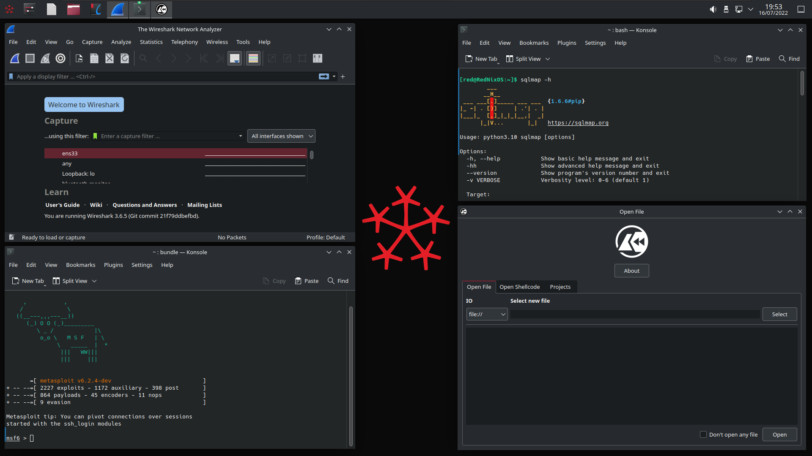

<h1 align="center"> RedNixOS </h1> <div align="center"> <br>NixOS 'distro' for security enthusiasts</a><br> 

 </div>

## What is this project?
RedNixOS aims to be a Kali-like Linux distribution built around NixOS, tailored for security researchers, pen-testers, red teamers and infosec enthusiasts.

## How to use
RedNixOS is intended to be used in one of the following ways:
1. Inside a virtual machine (for instance as a playground, or for testing purpouses).
2. Live install (capable of replacing Kali at times, but RedNixOS way cooler).
3. Persistent install (it _works_, but most people don't quite use it like this).

## Features
Simply put, this project is a pre-made NixOS config. Therefore, it's merely required to build the `.iso` file yourself. Furthermore, RedNixOS includes large amounts preinstalled software, as defined in `packages.nix` file, which you can accommodate to your needs.

By default, RedNixOS uses the Zen kernel, which might achieve better performance. Additionally, certain networking an security features are enabled, such as:
- `sudo` only for the `wheel` group
- AppArmor
- `lockKernelModules`
- a firewall with straightforward default configuration

## Build instructions
Once you have tweaked the distribution to your liking, or chose to trust the defaults we have prepared for you, run the following command:

```
nix build
```

> Note: by default, RedNixOS unstable will be built with KDE.

## FAQ

### 'Distro'?
Admittedly RedNixOS is not a distro in the literal meaning as often defined in Linux world. Instead, consider this project a modification of NixOS (as it literally is pre-configured NixOS).
Additionally, can be considered as a better version of existing [RedNix](https://github.com/redcode-labs/RedNix) - NixOS container and nix-shells.
RedNix was used as a basis for RedNixOS; all the packages are kept intact.

RedNixOS was heavily influenced by other projects besides **RedNix**, such as [nix-security-box](https://github.com/fabaff/nix-security-box) by [fabaff](https://github.com/fabaff/) - give it a try as well!

### How often will you the upstream?
We will try to keep it updated nearly as often as mainstream NixOS, using this as a chance to add some packages and bump the version numbers as well. Currently available Kali packages for nixpkgs are constantly listed by the [nix-security-box website](https://fabaff.github.io/nix-security-box/), as well as [this issue](https://github.com/NixOS/nixpkgs/issues/81418) and [this website](https://jjjollyjim.github.io/arewehackersyet/index.html).

### Contributing

Pull requests welcome. From different packages, through cosmetic tweaks to usability features.
